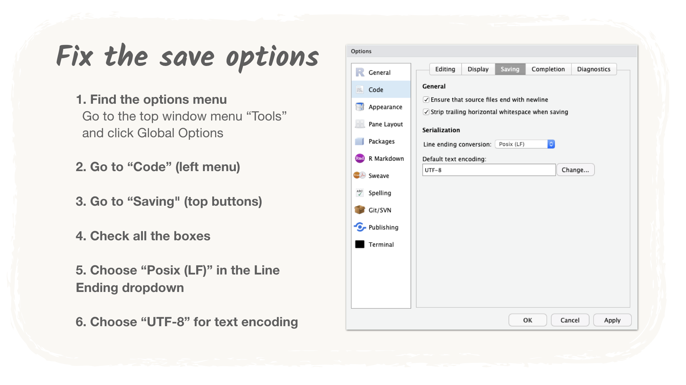
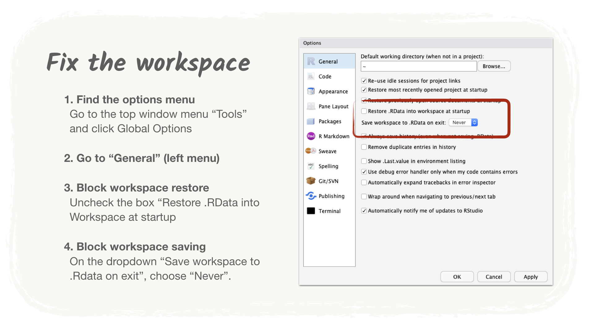

# Installing R, RStudio and Packages

[](http://www.youtube.com/watch?v=BJvWHs6ytEI "Video Title")

## New version of `R`

The video describes how to install `R` `3.5.0`. Version `3.5.1` is now out and you can install it instead.

## Packages

The video shows how to install the packages `{cowsay}` and `{ggplot2}`, but we need a lot more packages for the course. 

> By the way, when talking about packages we will use the convention to put their name in between curly brackets. That makes it easier to know what we are talking about when packages have common names, like package `{janitor}`.

You can run the code below in RStudio `Console` tab to install all the packages in one go:

```r
install.packages(c(
  "tidyverse",
  "rmarkdown",
  "janitor",
  "openxlsx",
  "datapasta",
  "dbplyr",
  "DBI",
  "odbc", 
  "RSQLite",
  "shiny",
  "devtools",
  "fs",
  "here",
  "ggmap",
  "leaflet"))
```

When the code is finished running, also run the line below. It needs to use the package `devtools` that we just installed: that's why we need to do it after the first big install.

```r
devtools::install_github("ropenscilabs/gramr")
```

## Problems with the install

If the install of `{gramr}` fails, please don't worry about it. This package is only a nice-to-have. 

If you have serious troubles with the rest of the packages, please reach out: we should try to find a solution together! But also don't stay stuck in the mean time: you can create a free account on [RStudio Cloud](https://rstudio.cloud/) and get nearly the exact same experience in your internet browser. You will be able to install packages and they will be waiting for you next time you connect. 

> Now, even if RStudio Cloud works well for you, **please do reach out** as we would like to make sure that you can work from your computer (especially if RStudio Cloud ceased suddenly to be free). 

##### Copy/Paste the code in the console and press enter


## A few important settings
### Fix the saving options

We want to change the default settings to a format that can handle accents. This is important even if you only write in English as you will sometimes receive datasets that have accents in it.



### Fix the workspace options

This is an important option. It will block RStudio from trying to save anything when you quit it. 

On the one hand, it means that you need to save what matters for you at the end of each sessions. So you will have to adopt good practices from the start. On the other hand, this will save you a lot of headaches. Thanks to this settings, you will not start your sessions with a bunch of old objects that you don't remember for sure what they are made of.




