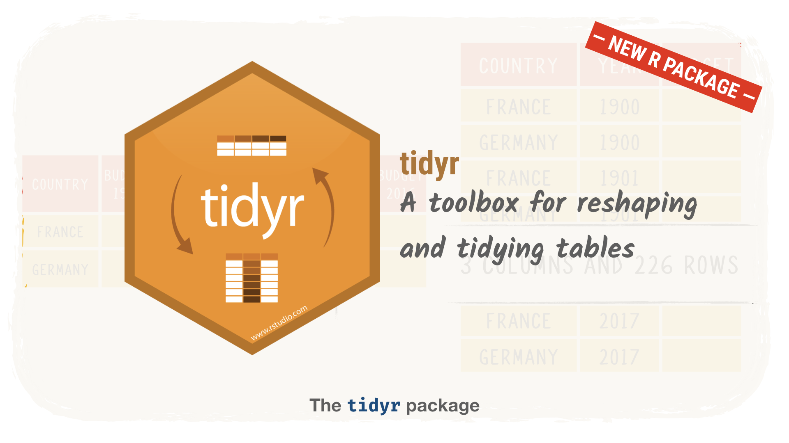
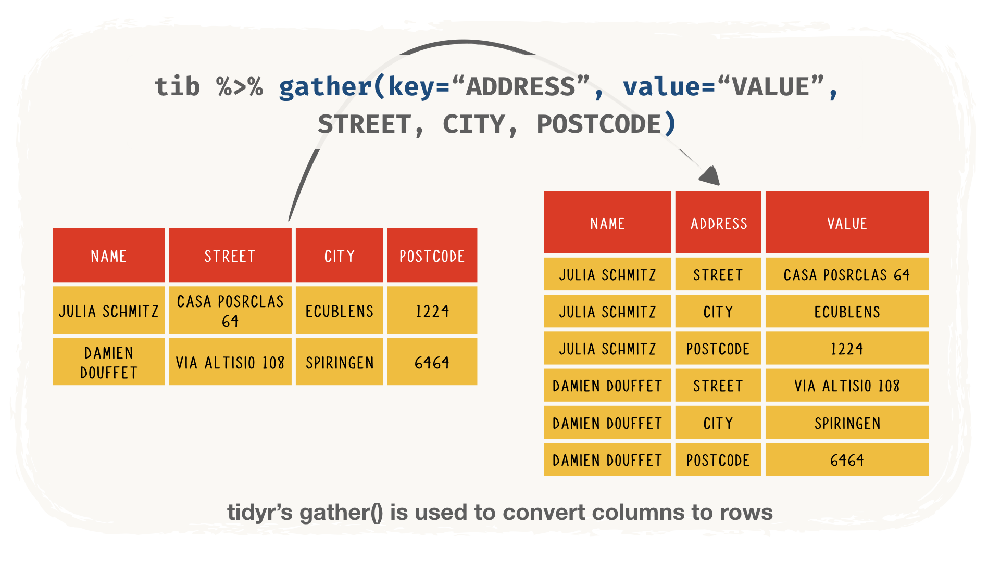
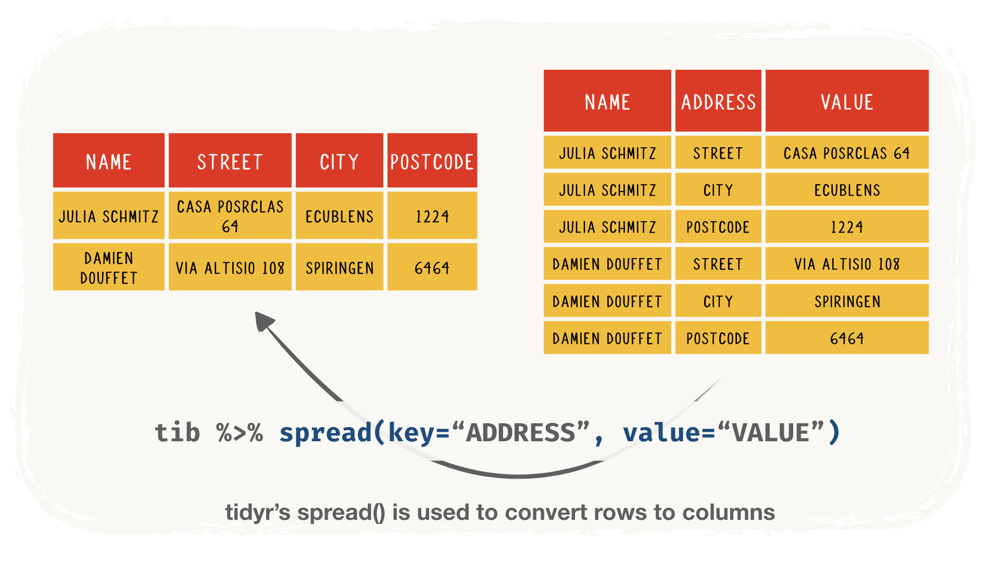
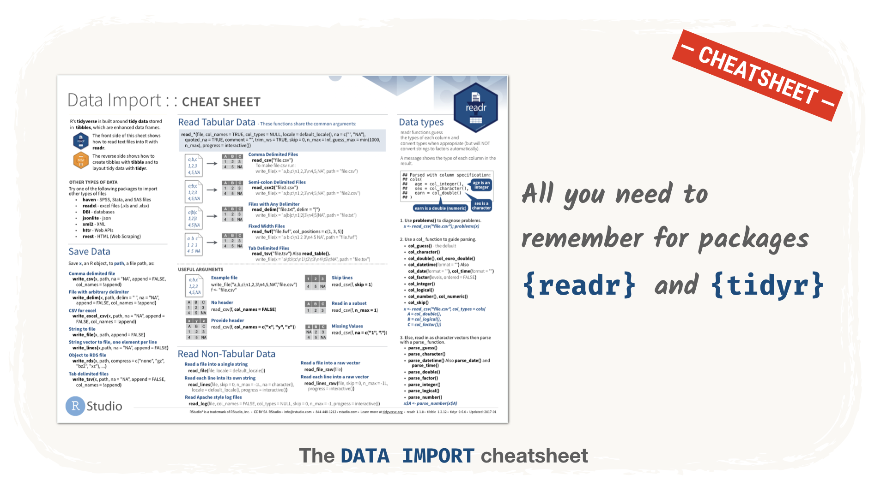

# Reshaping data with `{tidyr}`

## The `{tidyr}` package



The functions that we will present now are not part of the [`{dplyr}` package](http://bit.ly/2N7fcN8). They come from a [package called `{tidyr}`](http://bit.ly/2NBbDyn). `{dplyr}` and `{tidyr}` are really designed to work hand in hand. In terms of coding, it will feel like you are just using another `{dplyr}` function. The same patterns you have become used to are valid:

- first argument is a `tibble` (that can be provided via `%>%`)
- column names do not need quotes `"`
- functions return `tibble`s (that can be sent to other functions via `%>%`)

You don't always need `{tidyr}` when you work with `{dplyr}`, but you nearly always need `{dplyr}` when you work with `{tidyr}`. 

I like to think of `{tidyr}` as an extension of `{dplyr}` focused on heavy reshaping. When you are doing traditional things, `{dplyr}` is enough. When you need to really get your hands dirty with the data, you use `{dplyr}` and `{tidyr}`.

If you come from a background in `SQL`, you are in for a treat. Writing code to pivot data is much faster in `R` than in `SQL`.

If you come from a Microsoft Excel background, `{tidyr}` is the package we use to do the reshaping you do in "Pivot Tables".

## A word of warning

I mention background in `SQL`, background in `Excel`... But you might have neither one or the other. Or even if you have it, you might still find the idea of *reshaping* `tibble`s columns to rows (and vice-versa) confusing. It is definitely less intuitive than adding a column with `mutate()` for example. 

This unit is a strategic one, so don't hesitate to press the `Get Help` button and **book a 1-on-1 to discuss it**. It will be a good opportunity to clarify it and check that the rest of the `{dplyr}` content is well understood. 

## The `gather()` and `spread()` function

Although `{tidyr}` provides other helper functions, the main ones are `gather()` and `spread()`. As you will quickly see, these two functions are two sides of the same coin.

### How to make `gather()` and `spread()` available?

If you installed the packages recommended in the setup units, `{tidyr}` should already be installed on your machine. If you did not:

- go to the `Packages` tab in RStudio
- click `Install`
- search for `tidyr`
- click `Install`

Once `{tidyr}` is installed, you can make all its functions available by typing `library(tidyr)` in the RStudio `Console` tab.

### Columns to rows with `gather()`



In a pipeline, `gather()` look like this:

```r
tib %>%
  gather(key, value, <columns-to-convert-to-rows>)
```

`gather()` take the following arguments:

- `data=`: a `tibble` (usually provided as first argument by a pipe `%>%`)
- `key=`: the name of the column that will take the labels (the former column headers)
- `value=`: the name of the column that contains the values for the new rows
- any column names that you want to convert to rows (separated by `,`)

`gather()` returns a modified `tibble`.

##### Exercise

```
---QUIZZ---
Using your knowledge of `{dplyr}` and `{tidyr}` (you will need a real pipeline with many functions), reshape the `stones_data` `tibble` to a narrower `tibble` that shows for each album its average popularity and the number of songs in it in this format:

| album_name         | metrics         | value |
|--------------------|-----------------|-------|
| A Bigger Bang      | number_of_songs | 16    |
| A Bigger Bang      | avg_popularity  | 23.2  |
| Blue & Lonesome    | number_of_songs | 12    |
| Blue & Lonesome    | avg_popularity  | xxxx  |
| Bridges To Babylon | number_of_songs | 13    |
| Bridges To Babylon | avg_popularity  | 24    |
| First Hits         | number_of_songs | xxxx  |
| First Hits         | avg_popularity  | 19.6  |

(and 34 more rows...)

**What are the missing numbers (xxxx) ?** 

> If you feel stuck, choose the *hint* answer and click submit. You can also read the additional resources listed at the end of this page.

- [x] 15
- [x] 42.3
- [ ] 32.3
- [ ] 18
- [ ] 23.5
- [ ] 7
- [ ] I don't know where to start (hint)...{

Try to think in steps. First you need to create columns for number of songs and average popularity by album. Then, you will be able to do the reshaping.

Remember that each row is a song, so the number of rows in a group is also the number of songs in this group. And we saw that you use the function `n()` in `summarize()` to get the number of rows in a group.

You will need to use [`group_by()`](http://bit.ly/2qgjSCN) and [`summarize()`](http://bit.ly/2PXztlW) before you get to use `gather()`. Try to get this kind of table first and then use `gather()`:

    # A tibble: 21 x 3
      album_name            number_of_songs avg_popularity
      <chr>                           <int>          <dbl>
    1 A Bigger Bang                      16           23.2
    2 Blue & Lonesome                    12           42.3
    3 Bridges To Babylon                 13           24  
    ...
}

Well done! You can compare your code with the one below: 

    stones_data %>% 
      group_by(album_name) %>% 
      summarise(
        number_of_songs = n(), 
        avg_popularity = mean(song_popularity)) %>% 
      tidyr::gather(
        metrics, value, number_of_songs, avg_popularity) %>% 
      arrange(album_name)
---/QUIZZ---
```

```
---QUIZZ---
Using your knowledge of `{dplyr}` and `{tidyr}`, reshape the `sales_report` `tibble` to a narrower `tibble` that shows for each type of product the number of orders and the sum of all the quantity of these orders in this format:

| product_type | metrics          | value |
|--------------|------------------|-------|
| Classic Cars | number_of_orders | 967   |
| Classic Cars | total_quantity   | 33992 |
| Motorcycles  | number_of_orders | xxxxx |
| Motorcycles  | total_quantity   | 11663 |
| Planes       | number_of_orders | xxxxx |
| Planes       | total_quantity   | 10727 |

(and 8 more rows...)

**What are the missing numbers (xxxxx) ?**

> If you feel stuck, choose the *hint* answer and click submit. You can also read the additional resources listed at the end of this page.

- [x] 306
- [ ] 11234
- [ ] 7690
- [x] 331 
- [ ] 345
- [ ] 3452
- [ ] I don't know where to start (hint)...{

Try to think in steps. First you need to create columns for number of products and total quantity by types. Then, you will be able to do the reshaping.

You will need to use [`group_by()`](http://bit.ly/2qgjSCN) and [`summarize()`](http://bit.ly/2PXztlW) before you get to use `gather()`. Try to get this kind of table first and then use `gather()`:

    # A tibble: 7 x 3
      product_type     number_of_orders total_quantity
      <chr>                       <int>          <int>
    1 Classic Cars                  967          33992
    2 Motorcycles                   331          11663
    3 Planes                        306          10727
    ...

}

Well done! You can compare your code with the one below: 

    sales_report %>% 
      group_by(product_type) %>% 
      summarise(
        number_of_orders = n(), 
        total_quantity = sum(quantity)) %>% 
      tidyr::gather(
        metrics, value, number_of_orders, total_quantity) %>% 
      arrange(product_type)
---/QUIZZ---
```

### Rows to columns with `spread()`



In a pipeline, `spread()` look like this:

```r
tib %>%
  spread(key, value)
```

`spread()` takes the following arguments:

- `data=`: a `tibble` (usually provided as first argument by a pipe `%>%`)
- `key=`: the name of the column whose values should be converted to the headers of the new columns
- `value=`: the name of the column that contains the values for the new columns.

`spread()` returns a modified `tibble`.

```
---QUIZZ---
Using your knowledge of `{dplyr}` and `{tidyr}`, reshape the `stones_data` `tibble` to a smaller `tibble` that shows the number of songs per years split in live and not-live.

| release_year | not_live | Live |
|--------------|----------|------|
| 1989         | 12       | NA   |
| 1991         | 2        | 15   |
| 1994         | 15       | NA   |
| 1995         | NA       | 14   |
| 1997         | 13       | NA   |
| 2004         | NA       | 20   |
| 2005         | 16       | NA   |
| 2008         | NA       | xxxx |
| 2011         | NA       | 17   |
| 2012         | NA       | 13   |
| 2016         | xxxxxxxx | 92   |
| 2017         | 31       | 33   |
| 2018         | 15       | NA   |

**What are the missing numbers (xxxxxxx) ?**

> If you feel stuck, choose the *hint* answer and click submit. You can also read the additional resources listed at the end of this page.

- [ ] 13
- [x] 12
- [x] 20
- [ ] 32
- [ ] I don't know where to start (hint)...{

Try to think in steps. We want to show number of songs split by `release_year` and `live` status. So first you need to create columns for number of songs by `release_year` and `live` status and don't care to much about how it will look like. Then, when you have the right data, you will be able to do the reshaping.

Remember that each row is a song, so the number of rows in a group is also the number of songs in this group.

You will need to use [`group_by()`](http://bit.ly/2qgjSCN) and [`summarize()`](http://bit.ly/2PXztlW) before you get to use `gather()`. Try to get this kind of table first and then use `gather()`:

    # A tibble: 16 x 3
       release_year live  number_of_songs
              <int> <lgl>           <int>
     1         1989 FALSE              12
     2         1991 FALSE               2
     3         1991 TRUE               15
     4         1994 FALSE              15
    ...

}

Well done! Note that you could use the extra argument `fill=` in `spread()` to avoid having `NA` in the cell with no values. Here it would make sense to have 0.
   
    stones_data %>%
      group_by(live, release_year) %>%
      summarise(number_of_songs = n()) %>% 
      tidyr::spread(live, number_of_songs, fill=0) %>%
      rename(not_live = `FALSE`, live = `TRUE`)
---/QUIZZ---
```

```
---QUIZZ---
Using your knowledge of `{dplyr}` and `{tidyr}`, reshape the `sales_report` `tibble` to a smaller `tibble` that shows the amount of sales per deal sizes and status.

| status     | Large  | Medium  | Small   |
|------------|--------|---------|---------|
| Cancelled  | NA     | 115849  | 55346   |
| Disputed   | 29600  | 18270   | 7301    |
| In Process | 15300  | xxxxxxx | 33678   |
| On Hold    | 35310  | 95683   | 27918   |
| Resolved   | 4500   | 92042   | xxxxxxx |
| Shipped    | 654048 | 4568268 | 2428823 |

**What are the missing numbers (xxxxxxx) ?**

> If you feel stuck, choose the *hint* answer and click submit. You can also read the additional resources listed at the end of this page.

- [x] 71624
- [ ] 45699
- [x] 37327
- [ ] 32190
- [ ] 87923
- [ ] 12376
- [ ] I don't know where to start (hint)...{

Try to think in steps. We want to show total sales split by `deal_size` and order `status`. So first you need to create a `tibble` that shows the `sales` by `release_year` and `live` status and don't care too much about how it will look like. Then, when you have the right data, you will be able to do the reshaping.

You will need to use [`group_by()`](http://bit.ly/2qgjSCN) and [`summarize()`](http://bit.ly/2PXztlW) before you get to use `gather()`. Try to get this kind of table first and then use `gather()`:

    # A tibble: 17 x 3
       status     deal_size sales_amount
       <chr>      <chr>            <dbl>
     1 Cancelled  Medium         115849.
     2 Cancelled  Small           55346.
     3 Disputed   Large           29600 
     4 Disputed   Medium          18270.
     5 Disputed   Small            7301.
     6 In Process Large           15300 
    ...

If you don't have the `sales` column, remember that we have seen how to calculate it and add it with `mutate()`.

}

Well done! Note that you could use the extra argument `fill=` in `spread()` to avoid having `NA` in the cell with no values. Here it would make sense to have 0.

    sales_report %>%
      mutate(sales = unit_price * quantity) %>%
      group_by(status, deal_size) %>%
      summarise(sales = sum(sales)) %>% 
      tidyr::spread(deal_size, sales, fill=0)
    
---/QUIZZ---
```


## Conclusion

`spread()` and `gather()` are our go-to functions when it comes to reshaping a table from wide to long (and vice-versa).

Although you might think that it is only about `{readr}`, `{tidyr}` tips and tricks are included in the ["Importing data" cheatsheet from Rstudio's Github](http://bit.ly/2QqD8Jx).



## Resources

- [Chapter about `{tidyr}` in "Modern Dive" book](http://bit.ly/2D2Bjz8) 
- [Chapter about `{tidyr}` in "R for Data Science" book](http://bit.ly/2z8zZWY) 
